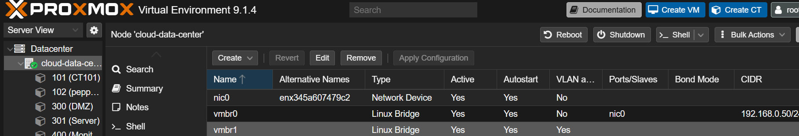

## Enterprise Network Segmentation with pfSense + Proxmox

A production-ready three-zone VLAN architecture implementing defense-in-depth security principles with isolated network segments for User, Server, and DMZ workloads.

---

## Network Architecture Diagram

```
                              INTERNET
                                 │
                                 │
                    ┌────────────▼────────────┐
                    │   Upstream Router       │
                    │   192.168.0.1           │
                    └────────────┬────────────┘
                                 │
                         ┌───────▼───────┐
                         │   vmbr0 (WAN) │
                         └───────┬───────┘
                                 │
                    ┌────────────▼─────────────┐
                    │   pfSense Firewall VM    │
                    │   WAN: 192.168.0.193     │
                    │   LAN: vtnet1 (trunk)    │
                    └────────────┬─────────────┘
                                 │
                         ┌───────▼───────┐
                         │ vmbr1 (LAN)   │
                         │ VLAN-aware    │
                         └───┬───┬───┬───┘
                             │   │   │
                    ┌────────┘   │   └────────┐
                    │            │            │
            ┌───────▼─────┐ ┌───▼──────┐ ┌──▼───────┐
            │  VLAN 10    │ │ VLAN 20  │ │ VLAN 30  │
            │  USER       │ │ SERVER   │ │  DMZ     │
            │ .10.0/24    │ │ .20.0/24 │ │ .30.0/24 │
            └──────┬──────┘ └────┬─────┘ └────┬─────┘
                   │             │            │
          ┌────────┴────────┐    │    ┌───────┴────────┐
          │                 │    │    │                │
    ┌─────▼─────┐  ┌────────▼────▼────▼─────┐  ┌──────▼──────┐
    │ lxc-user  │  │  lxc-db  lxc-monitor   │  │  lxc-nginx  │
    │   .10.50  │  │  .20.50     .20.20     │  │   .30.50    │
    └───────────┘  └────────────────────────┘  └─────────────┘
```

---

## 1. VLAN-Aware Bridge Configuration

**Achievement:** Enabled 802.1Q VLAN tagging on Proxmox's vmbr1 bridge to support multiple isolated network segments on a single physical interface.

**What we did:**

- Configured `vmbr1` with `bridge-vlan-aware yes` parameter

- Allowed VLAN IDs 2-4094 for flexible VLAN assignment

- This enables LXC containers to be tagged into specific VLANs

**Technical Details:**

```bash
# /etc/network/interfaces on Proxmox host
auto vmbr1
iface vmbr1 inet static
    address  10.0.1.10/24
    bridge-ports  enp3s0
    bridge-stp    off
    bridge-fd     0
    bridge-vlan-aware  yes
    bridge-vids   2-4094
```


---

## 2. pfSense VLAN Sub-Interfaces

**Achievement:** Created three VLAN sub-interfaces on pfSense's LAN trunk (vtnet1) to act as gateways for each isolated zone.

**What we did:**

- Created VLAN 10, 20, 30 on parent interface vtnet1

- Assigned static IPs to each VLAN sub-interface

- Enabled interfaces to route traffic between zones

**VLAN Assignment:**

| VLAN ID | Interface | IP Address     | Network Segment | Purpose |

|---------|-----------|----------------|-----------------|---------|

| 10      | USER      | 192.168.10.1   | 192.168.10.0/24 | Untrusted user workloads |

| 20      | SERVER    | 192.168.20.1   | 192.168.20.0/24 | Internal services (DB, LDAP, monitoring) |

| 30      | DMZ       | 192.168.30.1   | 192.168.30.0/24 | Public-facing services (web, mail) |

<!-- [Screenshot: pfSense VLAN Configuration](screenshots/02-pfsense-vlan-creation.png) -->

---

## 3. DHCP Server per VLAN

**Achievement:** Configured isolated DHCP pools for each VLAN with zone-specific DNS and gateway settings.

**What we did:**

- Enabled DHCP server on USER, SERVER, and DMZ interfaces

- Assigned non-overlapping IP ranges per zone

- Configured each DHCP scope to hand out the correct gateway and DNS server

**DHCP Configuration:**

| VLAN | Range Start    | Range End      | Gateway       | DNS Server    |

|------|----------------|----------------|---------------|---------------|

| 10   | 192.168.10.100 | 192.168.10.200 | 192.168.10.1  | 192.168.10.1  |

| 20   | 192.168.20.100 | 192.168.20.150 | 192.168.20.1  | 192.168.20.1  |

| 30   | 192.168.30.100 | 192.168.30.150 | 192.168.30.1  | 192.168.30.1  |


---

## 4. Firewall Aliases for Rule Readability

**Achievement:** Created reusable aliases for networks, ports, and hosts to make firewall rules maintainable and self-documenting.

**What we did:**

- Defined network aliases (RFC1918\_PRIVATE)

- Defined port group aliases (WEB\_PORTS, DNS\_NTP\_PORTS, DB\_PORTS)

- Defined host aliases for critical infrastructure (SYSLOG\_SERVER, MONITORING\_SERVER)

**Alias Examples:**

| Alias Name         | Type    | Value(s)                                      |

|--------------------|---------|-----------------------------------------------|

| RFC1918\_PRIVATE    | Network | 10.0.0.0/8, 172.16.0.0/12, 192.168.0.0/16    |

| WEB\_PORTS          | Port    | 80, 443, 8080, 8443                           |

| DNS\_NTP\_PORTS      | Port    | 53, 123                                       |

| SYSLOG\_SERVER      | Host    | 192.168.20.10                                 |

| MONITORING\_SERVER  | Host    | 192.168.20.20                                 |

| DMZ\_WEB            | Host    | 192.168.30.50                                 |


---

## 5. NAT Configuration (Outbound + Port Forwarding)

**Achievement:** Configured manual outbound NAT for all VLANs and port-forwarding rules to expose DMZ services to the internet.

**What we did:**

- Set outbound NAT to Manual mode

- Created masquerade rules for each VLAN subnet → WAN

- Configured port forwards from WAN to DMZ services (HTTP, HTTPS, SMTP)

**Outbound NAT Rules:**

| Source Network    | Translation         | Description              |

|-------------------|---------------------|--------------------------|

| 192.168.10.0/24   | WAN Interface (SNAT)| USER VLAN internet access|

| 192.168.20.0/24   | WAN Interface (SNAT)| SERVER VLAN updates      |

| 192.168.30.0/24   | WAN Interface (SNAT)| DMZ VLAN updates         |

**Port Forward Rules:**

| WAN Port | Protocol | Destination IP   | Dest Port | Service      |

|----------|----------|------------------|-----------|--------------|

| 80       | TCP      | 192.168.30.50    | 80        | HTTP → nginx |

| 443      | TCP      | 192.168.30.50    | 443       | HTTPS → nginx|

| 25       | TCP      | 192.168.30.60    | 25        | SMTP → mail  |


---

## 6. Floating Firewall Rules (Global Security Policy)

**Achievement:** Implemented high-priority floating rules that enforce security boundaries across all interfaces before per-interface rules are evaluated.

**What we did:**

- Created floating rules with "Quick" flag enabled (match immediately, skip further processing)

- Blocked DMZ from initiating connections to USER and SERVER zones

- Prevented loopback spoofing attacks

**Floating Rules:**

| # | Action | Source      | Destination  | Description                                    |

|---|--------|-------------|--------------|------------------------------------------------|

| F01 | BLOCK | 192.168.30.0/24 | 192.168.10.0/24 | Block DMZ → USER (prevents pivot to endpoints) |

| F02 | BLOCK | 192.168.30.0/24 | 192.168.20.0/24 | Block DMZ → SERVER (prevents internal breach)  |

| F03 | BLOCK | any         | 127.0.0.0/8     | Block loopback spoofing (anti-spoofing)        |

All rules have:

- **Quick:** Enabled (bypass per-interface rules)

- **Log:** Enabled (audit trail)

- **Direction:** Any


---

## 7. USER VLAN Firewall Rules (192.168.10.0/24)

**Achievement:** Implemented least-privilege access control for untrusted user workloads with strict egress filtering and lateral movement prevention.

**Security Principles Applied:**

- Default-deny posture (explicit allow only)

- Internet access restricted to web protocols only

- No direct access to SERVER zone

- Intra-VLAN lateral movement blocked

**USER VLAN Rules:**

| # | Action | Protocol | Source    | Destination              | Port        | Purpose                                    |

|---|--------|----------|-----------|--------------------------|-------------|--------------------------------------------|

| U01| ALLOW | TCP/UDP  | USER net  | 192.168.10.1             | 53, 123     | DNS + NTP to pfSense gateway               |

| U02| ALLOW | TCP      | USER net  | ! RFC1918 (internet only)| 80, 443     | Web browsing (blocks internal IP access)   |

| U03| ALLOW | TCP      | USER net  | DMZ net                  | 80, 443     | Access to internal web apps in DMZ         |

| U04| BLOCK | any      | USER net  | SERVER net               | any         | Strict isolation from Server zone (LOG)    |

| U05| BLOCK | any      | USER net  | USER net                 | any         | Client isolation (prevents pivoting) (LOG) |

| U06| BLOCK | any      | USER net  | DMZ net                  | any         | Block non-web DMZ access (SSH/RDP) (LOG)   |

| U07| BLOCK | any      | any       | any                      | any         | Default deny catch-all (LOG)               |

**Rules are processed top-to-bottom. Order matters.**


---

## 8. SERVER VLAN Firewall Rules (192.168.20.0/24)

**Achievement:** Secured internal services zone with egress-only internet access and role-based access control for monitoring and logging infrastructure.

**Security Principles Applied:**

- Servers cannot initiate connections to user endpoints

- Internet access limited to OS/package updates only

- Special allowances for SIEM (syslog) and monitoring servers

- Micro-segmentation within the zone (servers cannot talk to each other)

**SERVER VLAN Rules:**

| # | Action | Protocol | Source           | Destination              | Port     | Purpose                                      |

|---|--------|----------|------------------|--------------------------|----------|----------------------------------------------|

| S01| ALLOW | TCP/UDP  | SERVER net       | 192.168.20.1             | 53, 123  | DNS + NTP to pfSense                         |

| S02| ALLOW | TCP      | SERVER net       | ! RFC1918 (internet only)| 80, 443  | OS/package updates from external repos       |

| S03| ALLOW | UDP      | 192.168.20.10    | any                      | 514      | Syslog server collects logs from all zones   |

| S04| ALLOW | TCP      | 192.168.20.20    | DMZ net                  | 80, 443  | Monitoring server health checks on DMZ       |

| S05| BLOCK | any      | SERVER net       | USER net                 | any      | Servers must not contact endpoints (LOG)     |

| S06| BLOCK | any      | SERVER net       | SERVER net               | any      | Micro-segmentation within zone (LOG)         |

| S07| BLOCK | any      | any              | any                      | any      | Default deny catch-all (LOG)                 |


---

## 9. DMZ VLAN Firewall Rules (192.168.30.0/24)

**Achievement:** Isolated public-facing services with strict egress controls and one-way logging to internal SIEM.

**Security Principles Applied:**

- DMZ cannot initiate connections to USER or SERVER (enforced by Floating rules + per-interface rules for defense-in-depth)

- Internet access limited to updates only

- One-way syslog shipping to SERVER zone (no return path)

- Intra-DMZ isolation (container-to-container access blocked)

**DMZ VLAN Rules:**

| # | Action | Protocol | Source     | Destination              | Port    | Purpose                                        |

|---|--------|----------|------------|--------------------------|---------|------------------------------------------------|

| D01| ALLOW | TCP/UDP  | DMZ net    | 192.168.30.1             | 53, 123 | DNS + NTP to pfSense only                      |

| D02| ALLOW | TCP      | DMZ net    | ! RFC1918 (internet only)| 80, 443 | OS/package updates from external repos         |

| D03| ALLOW | UDP      | DMZ net    | 192.168.20.10            | 514     | One-way log shipping to SIEM in SERVER zone    |

| D04| BLOCK | any      | DMZ net    | USER net                 | any     | Defense-in-depth (redundant with F01) (LOG)    |

| D05| BLOCK | any      | DMZ net    | SERVER net               | any     | Defense-in-depth (redundant with F02) (LOG)    |

| D06| BLOCK | any      | DMZ net    | DMZ net                  | any     | Container isolation within DMZ (LOG)           |

| D07| BLOCK | any      | any        | any                      | any     | Default deny catch-all (LOG)                   |

**Note:** Rules D04 and D05 are redundant with Floating rules F01 and F02, but included as defense-in-depth in case floating rules are accidentally disabled.


---

## 10. DNS Resolver Configuration (Split DNS)

**Achievement:** Configured Unbound DNS resolver with access control lists to prevent DNS queries from unauthorized networks and cross-zone DNS leakage.

**What we did:**

- Enabled DNS resolver on USER, SERVER, DMZ interfaces only (not WAN)

- Configured custom access-control rules to refuse queries from untrusted sources

- Enabled DNSSEC for DNS query validation

- Rate-limited DNS queries to prevent amplification attacks

**DNS Access Control Configuration:**

```
access-control: 0.0.0.0/0 refuse
access-control: 192.168.10.0/24 allow
access-control: 192.168.20.0/24 allow
access-control: 192.168.30.0/24 allow
access-control: 10.0.1.0/24 allow
access-control: 127.0.0.0/8 allow
ip-ratelimit: 100
```

**This prevents:**

- Open DNS resolver abuse (internet hosts cannot query our DNS)

- Cross-zone DNS poisoning

- DNS amplification DDoS attacks


---

## 11. Remote Syslog (Centralized Logging)

**Achievement:** Configured pfSense to forward all firewall logs to a central syslog/SIEM server in the SERVER zone for security monitoring and incident response.

**What we did:**

- Enabled remote logging to 192.168.20.10:514 (SYSLOG\_SERVER)

- Configured firewall event logging (all allow/deny decisions)

- Created firewall rule S03 to allow syslog server to receive logs from all zones

**What gets logged:**

- All blocked traffic (U04-U07, S05-S07, D04-D07)

- Port forward hits

- NAT translations

- DHCP leases

- Authentication events

**Benefits:**

- Centralized security event correlation

- Historical audit trail

- Alerting on suspicious activity (e.g., repeated blocks from same source)

- Compliance requirements (log retention)


---

## 12. LXC Container Deployment in VLANs

**Achievement:** Successfully deployed LXC containers across three isolated VLANs with proper network segmentation enforced at the Proxmox bridge level.

**Container Configuration:**

| Container Name | VLAN Tag | IP Address     | Gateway       | Purpose                  |

|----------------|----------|----------------|---------------|--------------------------|

| lxc-user-01    | 10       | 192.168.10.50  | 192.168.10.1  | User workload (Ubuntu)   |

| lxc-syslog     | 20       | 192.168.20.10  | 192.168.20.1  | Central SIEM/Syslog      |

| lxc-monitor    | 20       | 192.168.20.20  | 192.168.20.1  | Prometheus/Grafana       |

| lxc-nginx      | 30       | 192.168.30.50  | 192.168.30.1  | Reverse proxy (public)   |

**Proxmox Network Configuration Example (lxc-user-01):**

```
net0: name=eth0,bridge=vmbr1,tag=10,ip=192.168.10.50/24,gw=192.168.10.1,firewall=1
nameserver: 192.168.10.1
```


---

### What We Achieved:

#### 1. **Zero Trust Network Segmentation**

- Three isolated trust zones with explicit deny-all policies

- Traffic between zones requires explicit firewall rule approval

- Compromised zone cannot pivot to others

#### 2. **Defense-in-Depth**

- Multiple layers: VLAN isolation → Floating rules → Per-interface rules → Intra-zone blocks

- Redundant controls (F01/F02 + D04/D05 for DMZ isolation)

- Logging at every enforcement point

#### 3. **Least Privilege Access**

- Users can only access internet + DMZ web apps (not databases, not SSH)

- Servers can only update from internet (not browse freely)

- DMZ can only log to SIEM (no lateral movement)

#### 4. **Lateral Movement Prevention**

- Intra-VLAN traffic blocked (U05, S06, D06)

- Users cannot pivot to other user containers

- DMZ breach cannot spread to USER or SERVER zones

#### 5. **Centralized Visibility**

- All firewall decisions logged

- Central SIEM receives logs from pfSense + all zones

- Security team has single pane of glass for monitoring

---

## Technology Stack

- **Hypervisor:** Proxmox VE 8.x

- **Firewall/Router:** pfSense 2.7+ (running as VM)

- **Containers:** LXC (Ubuntu 22.04/24.04)

- **Network:** 802.1Q VLANs on VLAN-aware Linux bridge

- **DNS:** Unbound resolver with split-horizon DNS

- **Logging:** Centralized rsyslog/syslog-ng


```

## Network Traffic Flow Examples

### Example 1: User browsing the internet

```
User LXC (192.168.10.50) → pfSense USER interface (192.168.10.1)
→ Rule U02 evaluates: TCP to non-RFC1918 port 443 → ALLOW
→ Outbound NAT translates 192.168.10.50 → 192.168.0.193 (WAN IP)
→ Traffic exits via WAN to internet
→ Return traffic: Stateful firewall allows established connection back
```

### Example 2: User trying to access internal database (blocked)

```
User LXC (192.168.10.50) → Attempts connection to 192.168.20.50:3306
→ Rule U04 evaluates: Destination = SERVER net → BLOCK + LOG
→ Packet dropped, event logged to syslog
→ User receives connection timeout
```

### Example 3: DMZ trying to pivot to SERVER zone (blocked)

```
DMZ LXC (192.168.30.50) → Attempts connection to 192.168.20.10:22
→ Floating Rule F02 evaluates FIRST (Quick=yes): DMZ → SERVER → BLOCK + LOG
→ Packet dropped immediately, never reaches per-interface rules
→ Event logged with "F02: Block DMZ->SERVER" in firewall log
```

### Example 4: External user accessing DMZ web server

```
Internet client → WAN IP (192.168.0.193:443)
→ Port forward rule: WAN:443 → 192.168.30.50:443
→ Associated WAN firewall rule: ALLOW TCP to 192.168.30.50:443
→ Traffic NAT'd and routed to DMZ nginx container
→ Nginx responds, return traffic follows stateful session back to client
```

---

## Future Enhancements

1\. **IDS/IPS Integration:** Install Suricata or Snort on pfSense WAN and DMZ interfaces for threat detection

2\. **VPN Access:** Deploy WireGuard/OpenVPN for secure remote access to management network

3\. **High Availability:** Deploy second pfSense in CARP HA cluster for failover

4\. **WAF:** Deploy ModSecurity or Cloudflare Tunnel in DMZ for application-layer protection

5\. **Network Monitoring:** Integrate ntopng or Zabbix for bandwidth analysis and anomaly detection

6\. **Certificate Management:** Deploy internal CA (Step-CA) for TLS certificate management

7\. **Backup Automation:** Automated pfSense config backups to git repository

---

## License

This project documentation is released under MIT License.

---

## Author

Created as part of enterprise network security implementation project.

**Repository:** [Your GitHub Username]/pfsense-proxmox-vlan-segmentation

**Last Updated:** February 2025

